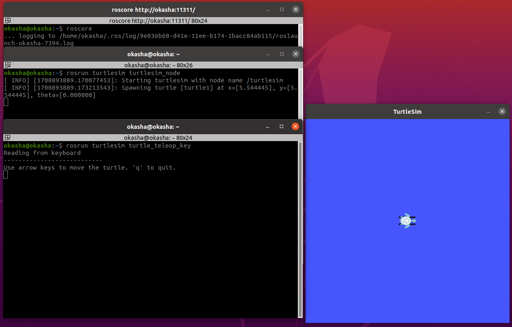
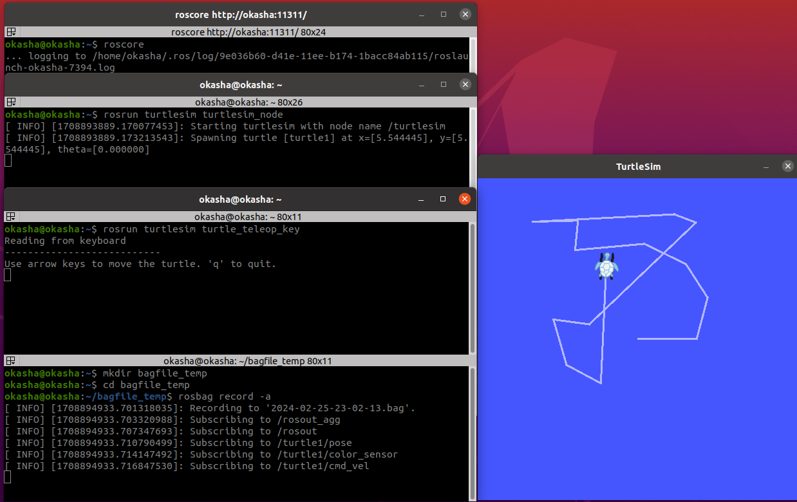
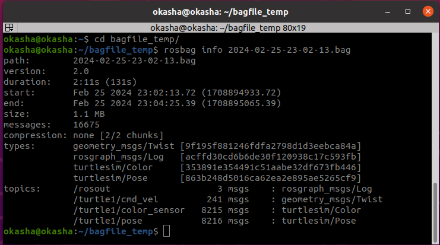

# ROS Bag
Author : Mahmoud Okasha
Reviewed By: Mo3taz
## ROS Bag
- A bag is a file format in ROS for storing ROS message
data.

- The rosbag command can record, replay, and
manipulate bags.

### Recording and playing back data

record data from a running ROS system into a `.bag` file, and then
playback the data to produce similar behavior in a running
system.

**Record data from a running Turtlesim system into a .bag file**

- Start `turtlesim_node` and `turtle_teleop_key`
1.
```bash
roscore
```


2.
```bash
rosrun turtlesim turtlesim_node
```


3.
```bash
rosrun turtlesim turtle_teleop_key
```


- Record data, make a temporary directory
```bash
mkdir bagfile_temp
cd bagfile_temp
rosbag record -a
```
and start to move `turtlesim` by `turtle_teleop_key` like this photo below


- Examining and playing the bag file

**To examine information on what was recorded in the bag, use the command:**
>note: you can change the name of `.bag` file in the example its name is `2024-02-25-23-02-13.bag`
```bash
cd bagfile_temp/
rosbag info 2024-02-25-23-02-13.bag
```


**To replay the bag file to reproduce the behavior in the running system:**
- Start `turtlesim_node`
1.
```bash
roscore
```


2.
```bash
rosrun turtlesim turtlesim_node
```


- Replay the bag file
```bash
cd bagfile_temp/
rosbag play 2024-02-25-23-02-13.bag
```


>**note:** If you want to replay the bag file with different rate use this command below.

```bash
rosbag play -r 2 2024-02-25-23-02-13.bag
```